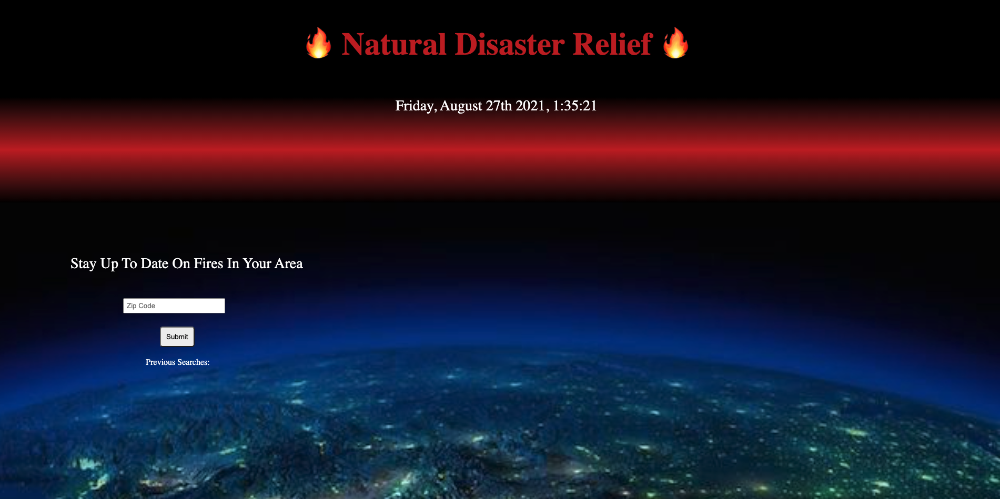

# Natural-Disaster Relief

The Natural Disaster Website is a user-friendly website that has the accumulation of various attributes that will all lead to the user being able to avoid fires, and much more!

Below is a screenshot of the website when it first loads in!

;

When this Website loads in you will be shown the title of the site labeled "Natural Disaster Relief" as well as the date and time. Right Below there is a prompt to give the user a chance to enter in a zip code, when that zip code is entered the following will occur

* The zip code will save to the website

* A map will appear showing the whole vicinity of the zip code that you have entered

* In that map you are given a chance to  zoom in and out 

* When the map loads in an API is started and is able to tell if there is a fire in the vicinity of that zip code that the user has eneterd in 

* If there is a fire nearby a "fire emoji" is shown, if there is no fire nearby there is no "fire emoji"

* If there is a fire nearby and the fire emoji is shown the user can then click on the fire emoji and is meet with a promp that will tell that user the air quality in that area

Below is an example of an image of the map when the user inserts their desired zip code 

;

This webstie was created using three main codin languages, those being Javascript, HTML, and lastly CSS. Inside of the Javascript code there where 3 main ApI's used, tha name of the websites holding those API's being called Bootsrap, Ambee, and Leaflet.

Below is a link to the finsihed website!

